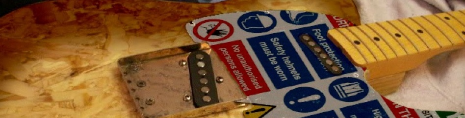

# Luthier Logs 

- [Luthier Logs](#luthier-logs)
  - [About](#about)
  - [Guitar Builds](#guitar-builds)
    - [Construction Grade Telecaster](#construction-grade-telecaster)
  - [Other Builds](#other-builds)
    - [Arduino Pickup Winder](#arduino-pickup-winder)

## About

This repo aims to serve as a documentation of my various guitar-build projects. Any sections subheaded with `LX` represent a Learning Experience - or rather, how I recognise I did something wrong, and what I would try next time.

## Guitar Builds

### Construction Grade Telecaster

**[Click here!](construction-grade-telecaster.md)**

This project was inspired by a scrap piece of wood I found on my walk into work one morning. I know this isn't exactly an original idea, but I think my implementation may be somewhat unique - offering a distinct visual style with a cohesive and clear "construction" theme throughout the piece. This is my first guitar build, and you can find the relevant log [here](construction-grade-telecaster.md).

## Other Builds

### Arduino Pickup Winder

