# Construction-grade Telecaster

My first guitar, and an absolute learning experience. There have been many mistakes made, and many lessons learned. But - as I write this - it still looks promising. I can't wait to have finished my first guitar.

> And the only way to begin is by beginning.

_Sam Reich (2020)_.

- [Construction-grade Telecaster](#construction-grade-telecaster)
  - [The Beginning](#the-beginning)
  - [Planning](#planning)
  - [The Wrong Tools For The Right Job](#the-wrong-tools-for-the-right-job)
  - [Shaping the Body - Part 1: Mostly Handsaws](#shaping-the-body---part-1-mostly-handsaws)
  - [Acquiring The Top](#acquiring-the-top)
  - [Glue-up](#glue-up)
    - [LX: I did not have enough clamps](#lx-i-did-not-have-enough-clamps)
    - [LX: Wood Filler wasn't a good idea](#lx-wood-filler-wasnt-a-good-idea)
  - [Shaping the Body - Part 2: Baby's First Router](#shaping-the-body---part-2-babys-first-router)
    - [LX: Don't Abuse Your Router](#lx-dont-abuse-your-router)
  - [Reinforcing the OSB with Resin](#reinforcing-the-osb-with-resin)
    - [LX: I didn't seal the OSB](#lx-i-didnt-seal-the-osb)
    - [LX: Uneven Layer](#lx-uneven-layer)
  - [Regarding Leg Holes](#regarding-leg-holes)
  - [Finding the Centre Line: The Theory](#finding-the-centre-line-the-theory)
  - [Finding the Centre Line: In Reality](#finding-the-centre-line-in-reality)

_As ever, LX represents a Learning Experience... Or a mistake. Whatever you want to call it, I'll write about how I'd consider doing it next time._
  
## The Beginning

After many joking discussions with my friend about an OSB guitar, on the merit of it being simply terrible, I decided to bring it into reality when I found a hardwood chair seat on a walk into work. I brought it to [Waterloo Music](https://waterloomusic.shop) and immediately traced a telecaster onto it with a pencil, and thickened up the outline with a Sharpie.

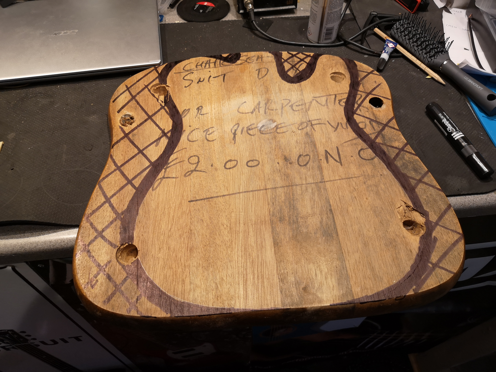

As it happened, this piece of `unknown wood` was millimetre perfect to turn into a Telecater. Some may call it fate, and I found myself compelled to answer it's call. This Telecaster was _begging_ to be released from it's chair-y prison.

By this point, the only plan was as follows:

``` none
Chair Body
OSB Top
Maple Neck
```

I had briefly considered pickup options, but was torn between two humbuckers, and doing a HS Tele akin to the Fender Vintera 70s Custom model.

## Planning

I'll admit, this piece of art has taken a few twists and turns, stylistically, however the Construction Theme was there from the very start. The plan evolved throughout the project while I worked on the body and with the materials, and as I did more research into the instrument and manufacturing processes.

The initial draft had the following features:

``` none
         Body:  Random Chair Wood
          Top:  OSB
         Neck:  Maple
      Pickups:  Humbuckers
 Scratchplate:  Construction-site safety signage
       Bridge:  Standard Chrome Hardtail w/ Ferrules
 Cavity Cover:  Standard Chrome
```

Later thoughts on the project brought the following evolutions:

``` none
Pickup Covers:  Black and yellow stripes
      Lacquer:  Two-tone Tobacco Burst
       Bridge:  Bigsby-style tremolo
```

At this point, I made a quick mockup in Photoshop, based on another OSB Tele I found online:

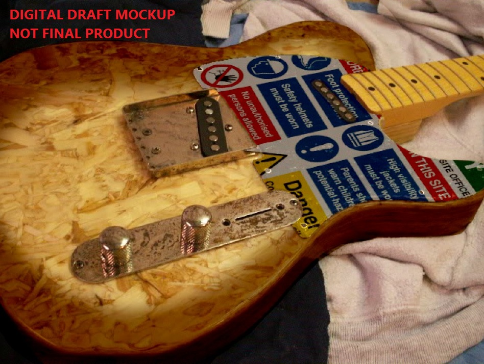

The current vision stands as follows:

``` none
         Body:  Random Chair Wood
          Top:  OSB
         Neck:  Maple
      Pickups:  Humbuckers
 Scratchplate:  Construction-site safety signage
       Bridge:  Standard Black Hardtail w/ Ferrules
 Cavity Cover:  Diamond-plate steel
Pickup Covers:  Black and yellow stripes
      Lacquer:  Two-tone Tobacco Burst on back, clear lacquered OSB on front
```

Eventually I plan on winding my own pickups and my own neck, and have already started planning for making my own Arduino-based pickup winder, but that'll be documented elsewhere in the future.
The CGTele will be - as much as possible - manufactured by me.

## The Wrong Tools For The Right Job

Maybe this section is more of a conclusion, but I'll put it fairly up-front while it's on my mind; I did not have access to a proper set of tools for this. As the saying goes, _a good craftsman never blames his tools_, and I'm not - simply acknowledging that I've done my best in spite of using many wrong tools, techniques, and practices. A trial by fire, as it were; learning on the job.

In time, I aspire to learn every facet of lutherie - how to design, build, and finish a guitar from scratch. I find the artistry fascinating, and the technicalities of manufacture has always enticed me. So, what better way to start than by getting stuck in?


## Shaping the Body - Part 1: Mostly Handsaws

Equipped with very few tools myself, I visited a friend to raid their shed for a few handtools. These were unideal, but I got the rough shape of the guitar cut out with an assortment of saws.

At this point, the aim was to cut the majority of wood within the thick black line, while still leaving a notable amount of ink around the edges to file the shape back to. I wasn't too worried about the "relief holes" caused by the chair legs, as these would be covered by the classy top wood.

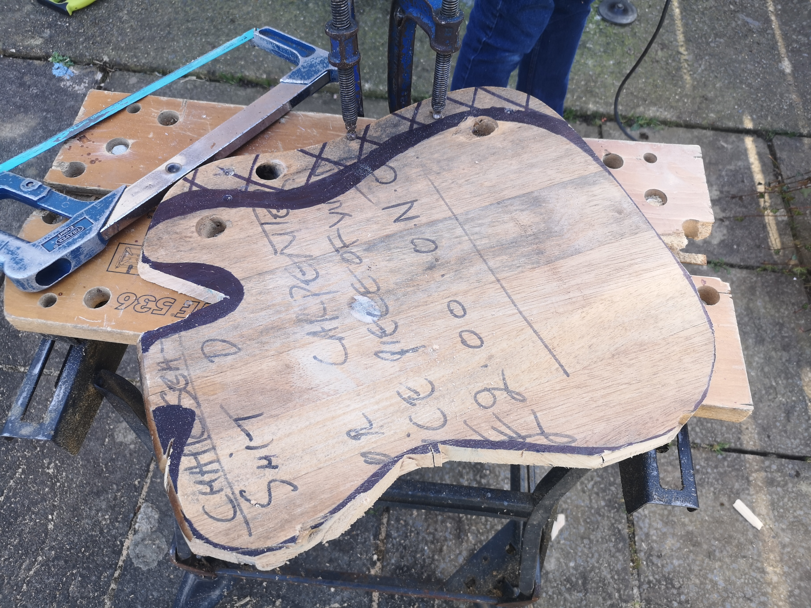

Once the bulk of the material was removed, I proceeded with a flap-disc sanding attachment on a drill to bring the frankly ugly cuts up to the line. You can see on the lower horn where I was slightly too liberal with my usage of the flap-disc sander, and accidentally ate too far into the piece. This mistake will be fixed with resin later on.

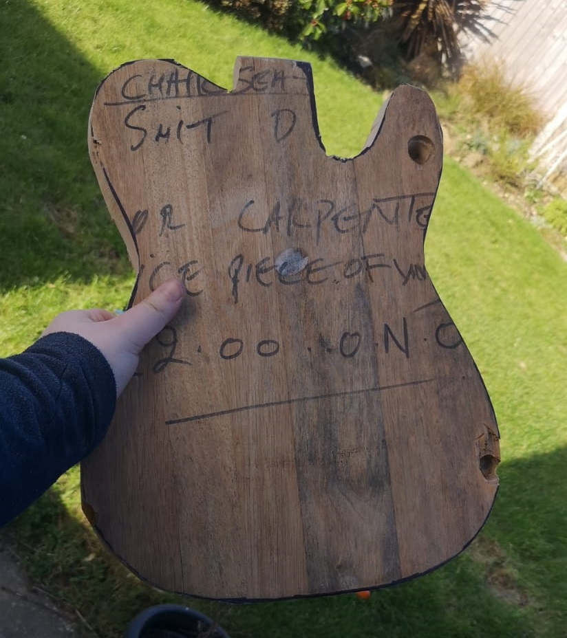

## Acquiring The Top

OSB is a terrible material to build a guitar out of. With that being said, I was on a path to find the constructiony-est looking bit of OSB I could. I found this piece, complete with OSB black text


I roughly cut this out to the shape of the Tele, but with plenty of leeway to account for innacurate placement, so I could clamp and glue it up without worrying too much about if it's a perfect match-up against the body shape.

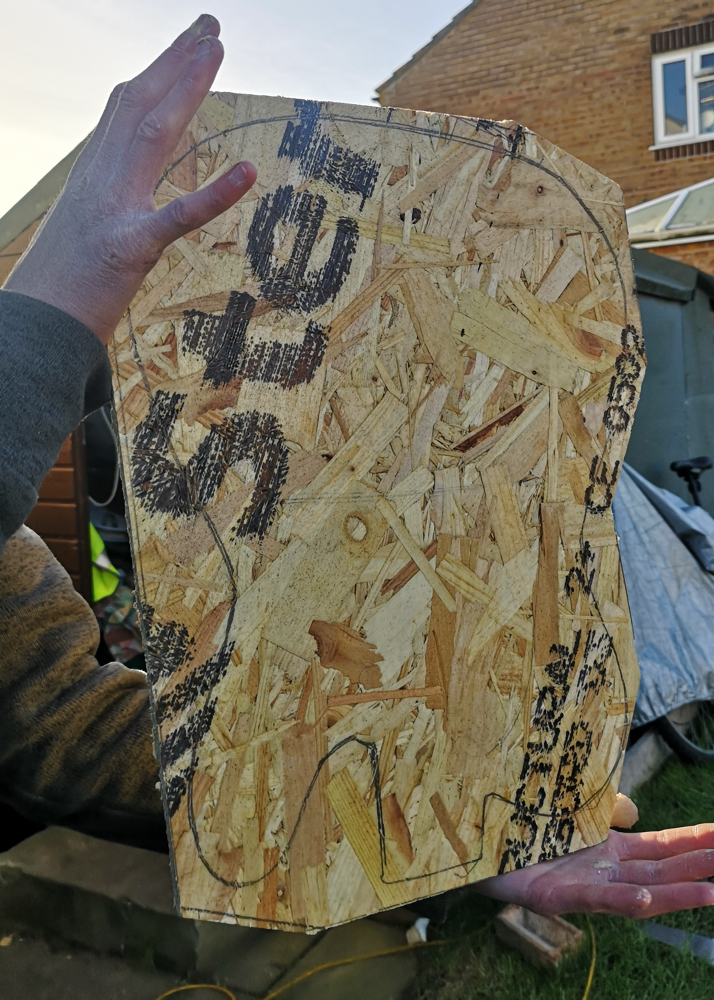

## Glue-up

Now the body was (roughly) cut to shape, I had to adhere the top. At this point I learned you cannot have enough clamps. I made a few mistakes here, but only realised once it was too late. Smother the chair part with a _lot_ of yellow wood glue, and clamp it together with as many clamps as I could acquire that day. Which was only four.


### LX: I did not have enough clamps

I wish I had more.
As a result of this, I used screws strategically placed under the scratchplate and neck, to try and create holes in places that will be eventually hidden. While this worked, I should have drilled pilot holes, as one of the screws I used caused the wood to split on the lower horn.

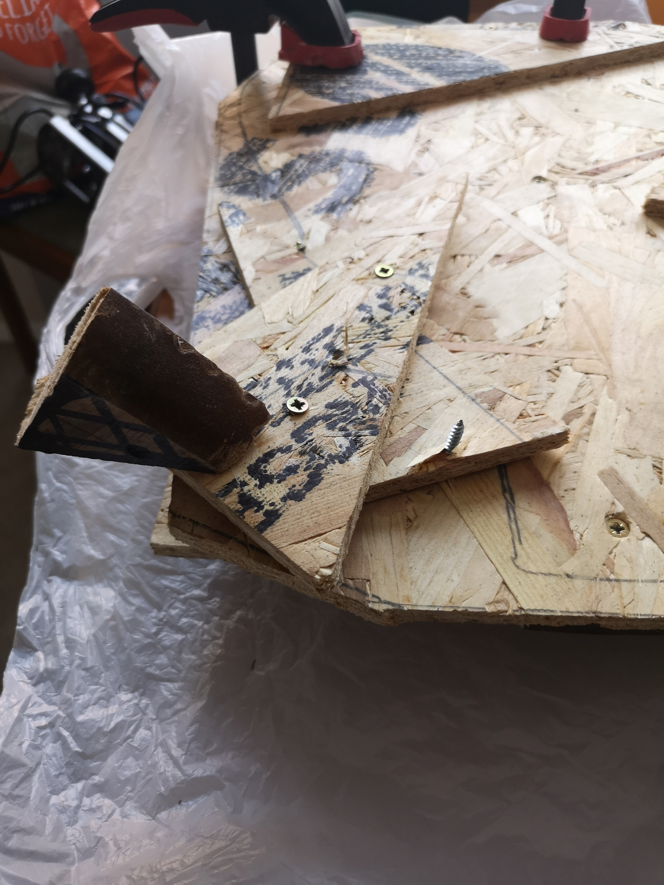

### LX: Wood Filler wasn't a good idea

I filled the bottom bonding surface of the OSB with wood filler, but since have read that it's very, very soft... and probably worse than just leaving the underside unfilled. Next time, I think I'll flood both sides of the top with resin, and probably also use resin to bond them together.

## Shaping the Body - Part 2: Baby's First Router

I've never worked with a router before, so this was new grounds for me. I ended up buying a cheap hand router from Facebook Marketplace for £15. I also acquired a flushcut trim bit from Toolstation to process the bulk of this. I used this to rip through the OSB and get the shape somewhat close to the final form.


The next step was fixing the rough concave curves between the neck and the horns - I did this with a set of rasps and files, which cleaned up the majority of the shoddiness caused by the handsaw and flap-disc work.

I'm still not 100% happy with this, but it's getting distinctly Telecasteresque! Here's the current state of it's front and back:

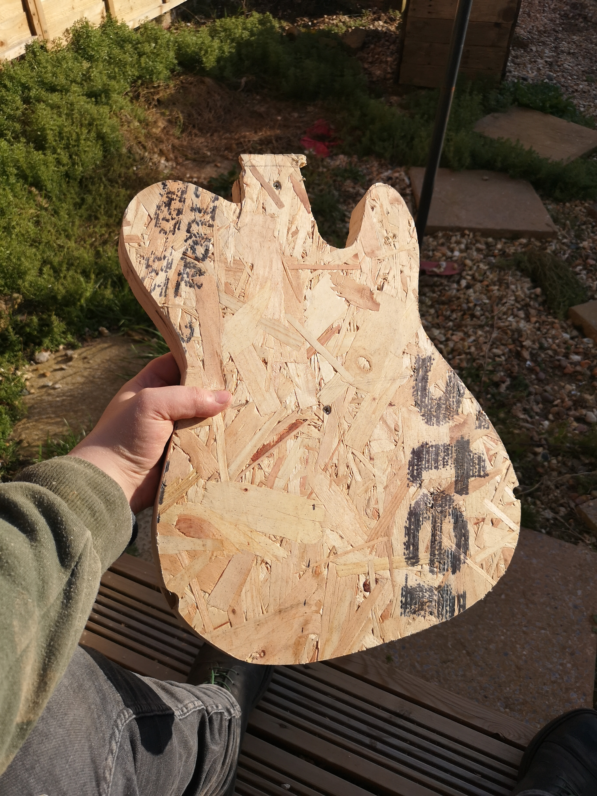
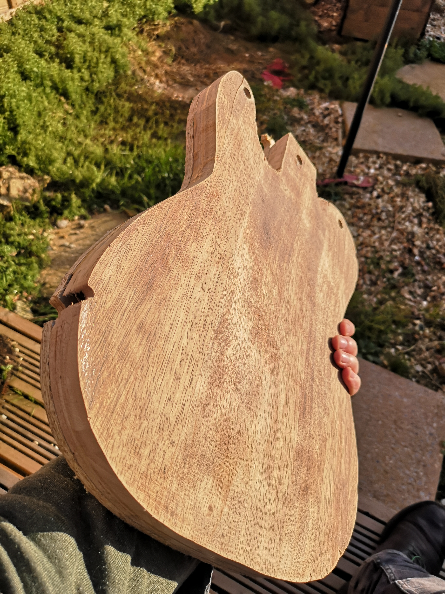

### LX: Don't Abuse Your Router

While I wasn't injured by this tool, I certainly didn't treat it well. I accidentally burned out the bearing on my flushcut bit through though this, so probably should have taken a hacksaw or something to cut out the bulk of the material first. The blade is mostly fine, though, it just needs a new bearing on the shaft of the bit. Not the end of the world, by any rate.

## Reinforcing the OSB with Resin

Obviously, the OSB top would be a simply horrible playing surface. I can't think of anything I'd want to use less as a guitar top, except maybe a sandpaper veneer. The plan from the beginning was to flood the OSB with a clear resin, to fill in the holes with crystal clear fluid, and then sand it back to a thin-ish layer I can then lacquer with the rest of the body. This would give a great working surface, without ruining the look of the OSB.

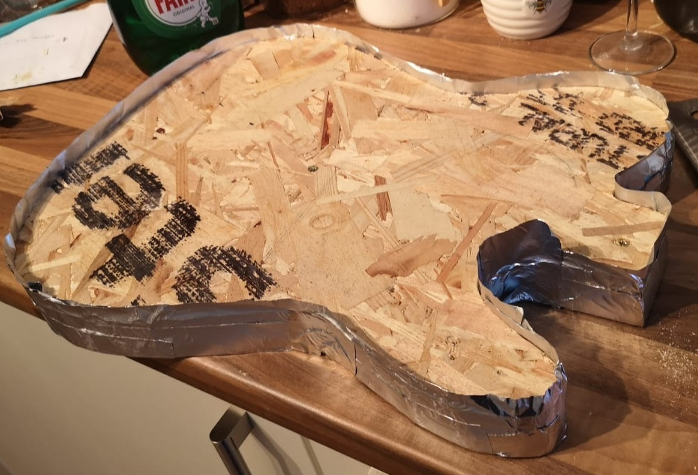

Firstly I sealed the edge of the guitar with aluminium tape to prevent leakage. This was relatively successful, though was a bit harder to remove than anticipated. I mixed the epoxy in a 1:1 ratio as per the bottle, poured it over the guitar and left it to cure for 2 days before touching it again. As the first coat was uneven, I mixed a small quantity and used it to patch the gaps, and left it again for two days to cure.

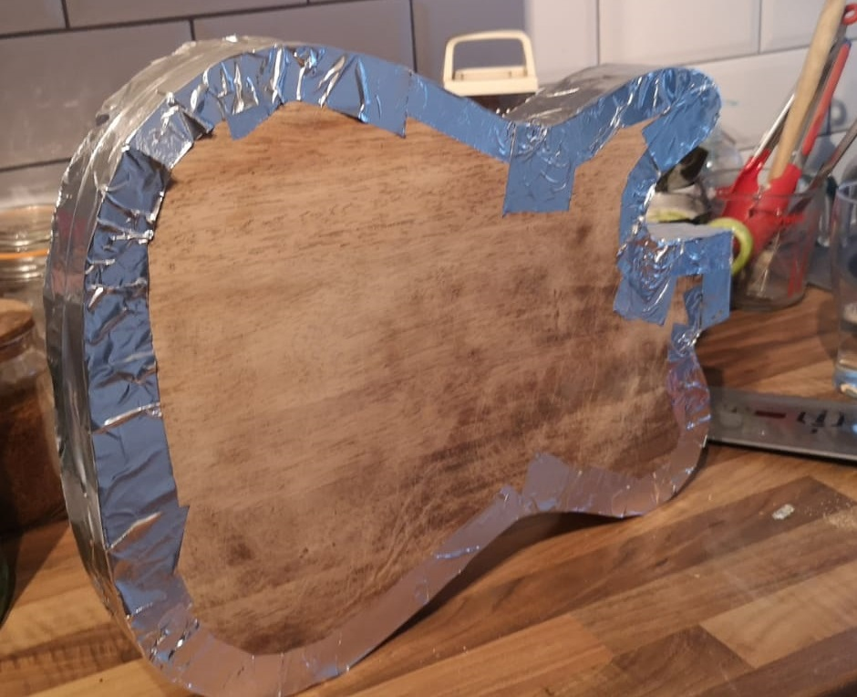

For yet another first in this project, I'm not too displeased with the result. It definitely needs a bunch of sanding to make it flat and even, but that shouldn't be too difficult. I'll take the majority of the resin off with 120 grit, then polish it down through the grits up to about 600ish to prep it for a clear lacquer.


### LX: I didn't seal the OSB

While I'm pretty pleased with my first-ever resin pour, I could have definitely done it better. The crisp black printed text leeched out into the resin, leaving it slightly blurry and leaving gross black particulates suspended in the resin. Now I know this, I would have tried to seal the guitar with either a lacquer or a very thin coat of resin to begin with.

You can see a video of this effect [here](https://drive.google.com/drive/folders/1M1zi420xZQg2jCMDfvQJn6vOxKPnYqoc).

### LX: Uneven Layer

I was expecting this. I did not level my worksurface, so the resin naturally flowed to a flat plane... which left valleys and a generally uneven working surface. Next time I do a resin pour, I'll do it on a known-level surface, or create my own surface leveller with a sheet of plywood and some thumbscrews to adjust the corners.

## Regarding Leg Holes

I intend on punching straight through the leg holes and including them in the overall profile of the Telecaster. It's part of it's story, with it being a chair - and I think it'll look cute. I have no further justification for this, aside _it's my project_. I don't need any further justification.

## Finding the Centre Line: The Theory

The workpiece is not even, I know that for a fact. It also means there's no easily definable centre line. What I intend on doing is finding "vertically equivalent" points at multiple points across the Tele (represented in Red), and drawing a line between them (Green). Then after finding the midpoint of each of those lines (Black), I should have a scatter-graph of sorts showing an approximate centre line. I'll average all of those for what I shall consider the Centre Line of this guitar (White).

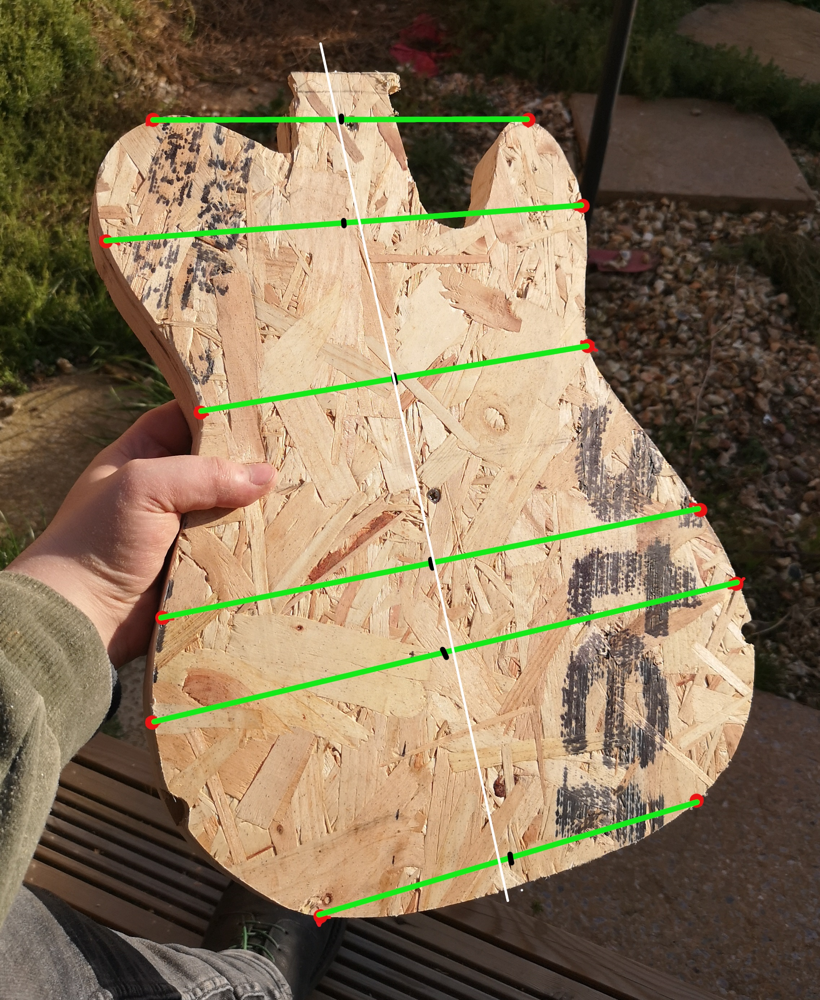

_There is almost certainly a better method for this._

## Finding the Centre Line: In Reality
