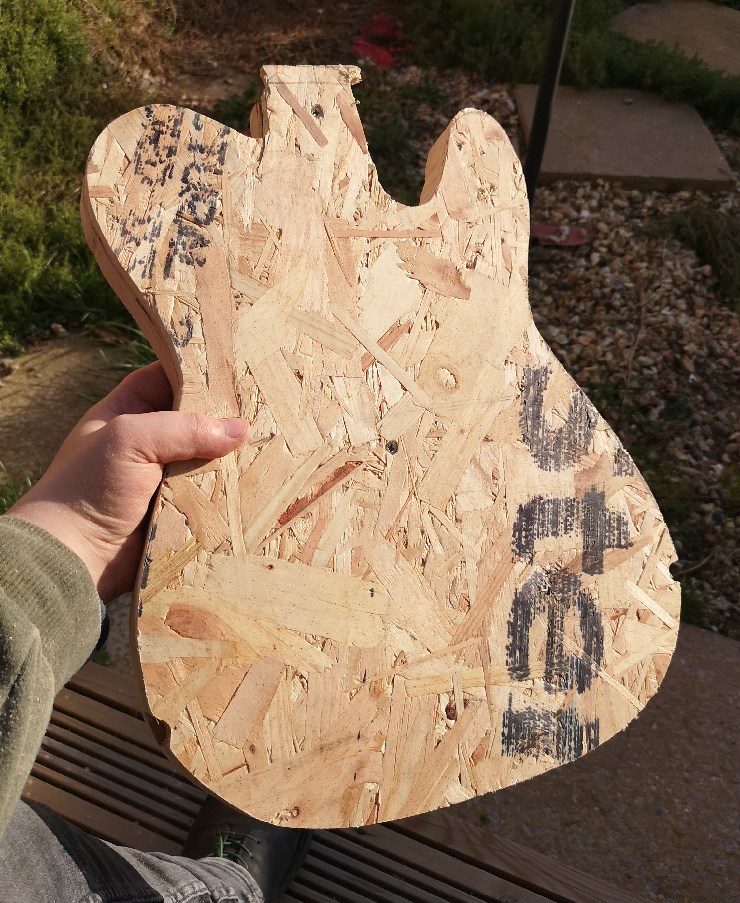

# Construction-grade Telecaster

My first guitar, and an absolute learning experience. There have been many mistakes made, and many lessons learned. But - as I write this - it still looks promising. I can't wait to have finished my first guitar.

- [Construction-grade Telecaster](#construction-grade-telecaster)
  - [The Beginning](#the-beginning)
  - [Planning](#planning)
  - [Shaping the Body - Part 1: Mostly Handsaws](#shaping-the-body---part-1-mostly-handsaws)
  - [Acquiring The Top](#acquiring-the-top)
  - [Glue-up](#glue-up)
    - [LX: I did not have enough clamps](#lx-i-did-not-have-enough-clamps)
    - [LX: Wood Filler wasn't a good idea](#lx-wood-filler-wasnt-a-good-idea)
  - [Shaping the Body - Part 2: Baby's First Router](#shaping-the-body---part-2-babys-first-router)
    - [LX: Don't Abuse Your Router](#lx-dont-abuse-your-router)
  
## The Beginning

After many joking discussions with my friend about an OSB guitar, on the merit of it being simply terrible, I decided to bring it into reality when I found a hardwood chair seat on a walk into work. I brought it to [Waterloo Music](https://waterloomusic.shop) and immediately traced a telecaster onto it with a pencil, and thickened up the outline with a Sharpie.


As it happened, this piece of `unknown wood` was millimetre perfect to turn into a Telecater. Some may call it fate, and I found myself compelled to answer it's call. This Telecaster was _begging_ to be released from it's chair-y prison.

By this point, the only plan was as follows:
```
Chair Body
OSB Top
Maple Neck
```

I had briefly considered pickup options, but was torn between two humbuckers, and doing a HS Tele akin to the Fender Vintera 70s Custom model.

## Planning

I'll admit, this piece of art has taken a few twists and turns, stylistically, however the Construction Theme was there from the very start. The plan evolved throughout the project while I worked on the body and with the materials, and as I did more research into the instrument and manufacturing processes.

The initial draft had the following features:

``` none
         Body:  Random Chair Wood
          Top:  OSB
         Neck:  Maple
      Pickups:  Humbuckers
 Scratchplate:  Construction-site safety signage
       Bridge:  Standard Chrome Hardtail w/ Ferrules
 Cavity Cover:  Standard Chrome
```

Later thoughts on the project brought the following evolutions:

``` none
Pickup Covers:  Black and yellow stripes
      Lacquer:  Two-tone Tobacco Burst
       Bridge:  Bigsby-style tremolo
```

The current vision stands as follows:

``` none
         Body:  Random Chair Wood
          Top:  OSB
         Neck:  Maple
      Pickups:  Humbuckers
 Scratchplate:  Construction-site safety signage
       Bridge:  Standard Black Hardtail w/ Ferrules
 Cavity Cover:  Diamond-plate steel
Pickup Covers:  Black and yellow stripes
      Lacquer:  Two-tone Tobacco Burst on back, clear lacquered OSB on front
```

Eventually I plan on winding my own pickups and my own neck, and have already started planning for making my own Arduino-based pickup winder, but that'll be documented elsewhere in the future.
The CGTele will be - as much as possible - manufactured by me.

## Shaping the Body - Part 1: Mostly Handsaws

Equipped with very few tools myself, I visited a friend to raid their shed for a few handtools. These were unideal, but we got the rough shape of the guitar cut out with an assortment of saws.

At this point, the aim was to cut the majority of wood within the thick black line, while still leaving a notable amount of ink around the edges to file the shape back to. I wasn't too worried about the "relief holes" caused by the chair legs, as these would be covered by the classy top wood.


Once the bulk of the material was removed, I proceeded with a flap-disc sanding attachment on a drill to bring the frankly ugly cuts up to the line.


## Acquiring The Top

OSB is a terrible material to build a guitar out of. With that being said, I was on a path to find the constructiony-est looking bit of OSB I could. I found this piece, complete with OSB black text


## Glue-up

Now the body was (roughly) cut to shape, I had to adhere the top. At this point I learned you cannot have enough clamps. I made a few mistakes here, but only realised once it was too late.


### LX: I did not have enough clamps

As a result of this, I used screws strategically placed under the scratchplate and neck, to try and create holes in places that will be eventually hidden. While this worked, I should have drilled pilot holes, as one of the screws I used caused the wood to split on the lower horn.


### LX: Wood Filler wasn't a good idea

I filled the bottom bonding surface of the OSB with wood filler, but since have read that it's very, very soft... and probably worse than just leaving the underside unfilled. Next time, I think I'll flood both sides of the top with resin, and probably also use resin to bond them together.

## Shaping the Body - Part 2: Baby's First Router

I've never worked with a router before, so this was new grounds for me. I ended up buying a cheap hand router from Facebook Marketplace for £15. I also acquired a flushcut trim bit from Toolstation to process the bulk of this.


### LX: Don't Abuse Your Router

While I wasn't injured by this tool, I certainly didn't treat it well. I accidentally burned out the bearing on my flushcut bit through though this, so probably should have taken a hacksaw or something to cut out the bulk of the material first. The blade is mostly fine, though, it just needs a new bearing on the shaft of the bit. Not the end of the world, by any rate.

After the body was brought fairly close to it's final shape, 


